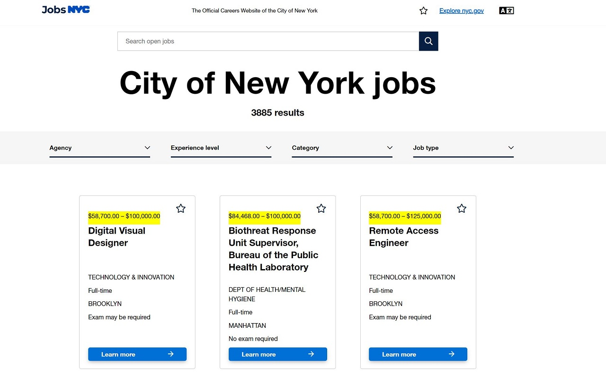

## Summary

Display hidden details on Job Vacancies listed on the NYC Career Pages.

## Usage

To use this extension, clone this repo and use 'Load Unpacked Extension'.
Read more on [Development Basics](https://developer.chrome.com/docs/extensions/mv3/getstarted/development-basics/#load-unpacked).

## Changelog

- (v1.1.0) Display and highlight the "Posted On" date in the job postings job details.
- (v1.0.0) Display and highlight the salary range on the job listing vacancy tiles.
